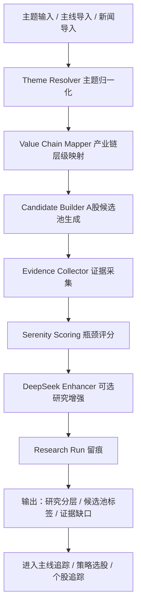

# Serenity 供应链瓶颈研究模块开发设计

> 版本：v0.1  
> 日期：2026-06-15  
> 适用范围：A 股市场优先  
> 模块定位：主题研究、产业链瓶颈识别、候选公司证据链分层，不直接生成买入指令。

---

## 1. 模块定位

Serenity 瓶颈研究模块不是普通选股器，也不是交易信号模块。它是系统的“产业链认知层”，用于在主线策略和个股策略之前，判断一个主题是否有真实产业逻辑，以及哪些公司真正靠近稀缺环节。

它主要回答：

- 这个主题的真实产业链层级是什么？
- 哪些层级更可能成为供给瓶颈？
- A 股里有哪些公司靠近这些瓶颈？
- 哪些公司只是概念相关，证据不足，甚至应该剔除？
- 后续需要验证哪些公告、财报、客户、产能、订单、互动易信息？
- 这个主题是否值得进入主线追踪、策略选股或个股追踪模块？

它不直接回答：

- 今天是否买入；
- 买多少仓位；
- 是否追涨；
- 是否突破买点成立。

交易动作仍由现有规则链完成：

```text
大盘状态 -> 主线阶段 -> 候选股过滤 -> 买点质量 -> 风险约束 -> 仓位建议
```

Serenity 只影响“研究优先级”和“候选池质量”，不能越过交易规则直接发出买入信号。

---

## 2. 使用逻辑

### 2.1 默认模式：主题驱动

用户只需要输入或选择一个主题，例如：

- AI 半导体
- CPO 光通信
- 机器人执行器
- 先进封装
- 电子特气
- 固态电池
- 液冷服务器

系统自动完成：

1. 主题归一化；
2. 产业链层级拆解；
3. A 股候选公司生成；
4. 公司证据链采集；
5. 瓶颈评分；
6. 研究分层；
7. 历史留痕。

用户不应该被要求先填候选公司。候选公司应由系统自动生成。

### 2.2 导入模式：从系统已有结果进入

Serenity 应支持从以下模块导入：

- 今日主线：把当前主线板块转成研究主题；
- 策略选股：把策略候选股导入做产业链验证；
- 个股追踪：对已有持仓或观察股做瓶颈复核；
- 新闻事件：从盘前事件、政策、外围产业变化形成主题。

示例：

```text
今日主线：通信设备、元件、电子特气
系统生成主题建议：
1. CPO 光通信供应链
2. 高速 PCB 与连接器
3. 电子特气国产替代
```

### 2.3 高级模式：手动候选公司比较

保留当前手动候选公司输入，但它只应作为高级模式使用。

适用场景：

- 用户明确想比较几家公司；
- 系统候选池缺失，需要人工补充；
- 对某条产业链做研究复盘；
- 手动输入外部看到的研究线索。

示例：

```text
主题：半导体设备
候选公司：北方华创、中微公司、拓荆科技、华海清科
目标：比较谁更接近先进制程扩产瓶颈
```

---

## 3. 产品流程

### 3.1 第一屏交互

默认页面不应展示一堆评分输入框，而应是主题入口。

```text
瓶颈研究

[输入主题 / 搜索主题：AI半导体、CPO、机器人...]

[从今日主线导入] [从策略选股导入] [从新闻事件导入]

推荐主题：
AI半导体 | CPO光通信 | 先进封装 | 电子特气 | 机器人执行器
```

### 3.2 主题模糊检索

输入关键词时，系统给出主题建议。

```text
输入：AI
建议：
- AI 算力供应链
- AI 半导体
- CPO 光通信
- 液冷服务器
- 高速 PCB
- 先进封装
```

检索来源：

- 内置主题词库；
- 历史主线；
- 热门板块；
- 近期新闻事件；
- 用户历史研究；
- DeepSeek 可选扩展。

### 3.3 研究结果展示

结果页应分为五块。

#### 1. 产业链层级图

展示从需求端到瓶颈层的路径。

```text
AI 算力需求
  -> 服务器 / 数据中心
  -> GPU / ASIC / 交换机
  -> CPO / PCB / 电源 / 散热
  -> 光芯片 / 高速材料 / 先进封装 / 电子特气
```

#### 2. 瓶颈层级排序

每个层级展示：

- 瓶颈强度；
- 扩产难度；
- 供应商集中度；
- 需求拐点；
- 证据质量；
- 主要反证。

#### 3. A 股候选公司

公司分层：

- 优先研究；
- 加入观察池；
- 证据不足；
- 概念偏离；
- 建议剔除；
- 人工复核。

#### 4. 证据链

证据来源包括：

- 板块成分；
- 主营业务；
- 财报摘要；
- 公告；
- 互动易 / 上证 e 互动；
- 产能项目；
- 客户认证；
- 订单合同；
- 资金与走势表现。

#### 5. 下一步验证清单

输出可执行的核验任务，例如：

- 检查某公司近两年年报中相关业务收入占比；
- 查询是否有客户认证或订单公告；
- 检查在建产能是否真实投产；
- 跟踪互动易是否回应相关产品；
- 观察是否进入主线核心股结构。

---

## 4. 数据流设计



---

## 5. 后端模块拆分

建议在 `src/lib/serenity` 下继续拆分。

```text
src/lib/serenity/
  types.ts                 # 类型定义
  scoring.ts               # 已有评分逻辑
  research.ts              # 已有 run 创建和查询
  themes.ts                # 主题词库、同义词、模糊检索
  themeResolver.ts         # 主题归一化
  valueChainMapper.ts      # 产业链层级映射
  candidateBuilder.ts      # A股候选池生成
  evidenceCollector.ts     # 证据采集
  evidenceGrader.ts        # 证据强度评级
  deepseekEnhancer.ts      # 可选大模型增强
  importers/
    fromMainline.ts        # 从今日主线导入
    fromSelection.ts       # 从策略选股导入
    fromNews.ts            # 从新闻事件导入
  repositories/
    serenityRunsRepository.ts
```

不要继续把所有逻辑堆在 `research.ts` 或单个组件里。

---

## 6. API 设计

### 6.1 主题检索

```http
GET /api/serenity/themes?q=AI
```

返回：

```json
{
  "success": true,
  "data": [
    {
      "id": "ai-semiconductor",
      "name": "AI 半导体",
      "aliases": ["AI芯片", "算力芯片", "半导体国产替代"],
      "source": "builtin"
    }
  ]
}
```

### 6.2 主题预览

```http
POST /api/serenity/preview
```

用途：不生成正式 run，只预览产业链层级和可能候选池，避免浪费 token。

### 6.3 创建研究 run

```http
POST /api/serenity/runs
```

已有接口继续保留，但输入从“手动候选公司”扩展为：

```json
{
  "theme": "AI 半导体",
  "market": "A股",
  "timeWindow": "未来 3-12 个月",
  "mode": "auto",
  "source": "manual-theme",
  "options": {
    "useDeepSeek": false,
    "candidateLimit": 50,
    "strictEvidence": true
  }
}
```

### 6.4 从主线导入

```http
POST /api/serenity/import/mainline
```

输入：

```json
{
  "reportId": "latest",
  "sectorNames": ["通信设备", "元件", "电子特气"]
}
```

### 6.5 历史列表和详情

继续使用：

```http
GET /api/serenity/runs?limit=20
GET /api/serenity/runs/:id
```

后续增加：

```http
DELETE /api/serenity/runs/:id
POST /api/serenity/runs/:id/promote
```

`promote` 用于把优先研究公司加入观察池、主线候选池或个股追踪池。

---

## 7. 数据库设计

已有表：

```text
serenity_research_runs
```

建议后续新增：

### 7.1 主题表

```text
serenity_themes
- id
- name
- aliasesJson
- market
- category
- chainTemplateJson
- source
- createdAt
- updatedAt
```

### 7.2 公司证据表

```text
serenity_evidence_items
- id
- runId
- stockCode
- stockName
- theme
- claim
- sourceType
- sourceName
- sourceUrl
- strength
- verified
- capturedAt
```

### 7.3 候选公司结果表

```text
serenity_candidates
- id
- runId
- stockCode
- stockName
- chainPosition
- bottleneckLayer
- score
- priority
- evidenceStrength
- actionTag
- reason
- missingProofJson
- riskJson
- rawJson
```

短期可以继续把完整 JSON 存在 `serenity_research_runs` 里。等功能稳定后，再拆成明细表，方便筛选和复盘。

---

## 8. 评分逻辑

当前已固化 Serenity scorecard：

正向因子：

- 需求拐点；
- 架构耦合；
- 瓶颈强度；
- 供应商集中度；
- 扩产难度；
- 证据质量；
- 认知差；
- 催化时点。

风险扣分：

- 融资稀释；
- 治理风险；
- 地缘风险；
- 流动性风险；
- 概念炒作；
- 会计质量；
- 周期性；
- 替代路径风险。

后续要补充两层：

### 8.1 产业链层级评分

先给层级打分，再给公司打分。

示例：

```text
先进封装：高瓶颈
电子特气：中高瓶颈
普通芯片设计：中瓶颈
下游应用软件：低瓶颈
```

### 8.2 公司贴近度评分

公司不只是看属于哪个板块，还要判断：

- 是否控制瓶颈；
- 是否供应瓶颈；
- 是否只是受益；
- 是否只是概念相关；
- 是否缺少直接证据。

---

## 9. DeepSeek 使用边界

DeepSeek 应默认关闭，用户手动开启，避免 token 消耗过快。

适合 DeepSeek 做的事：

- 主题拆解；
- 产业链层级推理；
- 证据缺口总结；
- 反证条件；
- 公司是否蹭概念；
- 研究结论润色；
- 下一步核验清单。

不适合 DeepSeek 做的事：

- 编造客户、订单、产能；
- 直接给买入指令；
- 替代行情和财务数据；
- 在证据不足时强行给确定结论；
- 越过规则引擎改变仓位。

DeepSeek 输入应控制大小：

- 不发送完整 FactPackage；
- 只发送主题、候选公司摘要、证据摘要、评分结果、缺失项；
- 历史只发送最近摘要，不发送完整历史 JSON；
- 校验失败不重复发送全量上下文。

---

## 10. 前端设计

### 10.1 页面结构

```text
瓶颈研究

顶部：
主题搜索框 + 导入按钮 + DeepSeek 开关

主体：
左侧：主题、产业链层级、历史研究
右侧：研究结果

结果：
1. 产业链图谱
2. 瓶颈层级排序
3. A股候选公司卡片
4. 证据链折叠区
5. 下一步验证清单
```

### 10.2 信息密度控制

默认只展示：

- 主题；
- 最高优先级层级；
- Top 5 公司；
- 每家公司一句理由；
- 证据强度；
- 缺失证据数量。

详情通过展开、悬浮卡片、抽屉查看。

### 10.3 股票悬浮卡片复用

所有股票名都应复用现有股票 hover 能力：

- 涨跌幅；
- 当前价；
- 成交额；
- 换手率；
- 主力资金；
- 所属板块；
- 最近动作；
- K 线简图。

Serenity 只额外展示：

- 产业链位置；
- 瓶颈层级；
- 证据强度；
- 是否建议加入观察池。

---

## 11. 与其他模块关系

### 11.1 主线追踪

Serenity 帮主线追踪解决：

- 主线是否有真实产业逻辑；
- 核心股是否真核心；
- 后排是否蹭概念；
- 同名板块和概念板块如何归并；
- 哪些板块值得长期观察。

### 11.2 策略选股

Serenity 帮策略选股解决：

- 候选股是否属于高价值产业链；
- 是否只是技术形态好但产业逻辑弱；
- 是否应该进入 Agent 深度分析。

### 11.3 个股追踪

Serenity 帮个股追踪解决：

- 持续跟踪其产业链位置是否变化；
- 核验新公告是否强化瓶颈逻辑；
- 判断是否从“优先研究”降为“证据不足”。

---

## 12. 分阶段开发计划

### Phase 1：产品化入口改造

目标：把页面从手动评分表改成主题研究入口。

任务：

- 新增主题搜索框；
- 新增内置主题词库；
- 新增 `/api/serenity/themes`；
- 新增“从今日主线导入”按钮；
- 隐藏手动评分表到高级模式；
- 保留历史留痕。

验收：

- 输入 `AI` 可以返回主题建议；
- 点击主题可以生成预览；
- 不需要手动输入候选公司也能进入研究流程。

### Phase 2：A 股候选池自动生成

目标：系统自动找公司。

任务：

- 根据主题映射板块和概念；
- 从东方财富 / Tushare / Westock 拉成分股；
- 结合主营关键词做初筛；
- 给每家公司生成初始产业链位置；
- 排除明显无关公司。

验收：

- 输入 `CPO` 能生成光模块、光芯片、PCB、连接器等候选；
- 输入 `电子特气` 能生成相关 A 股公司；
- 每家公司有初步归属理由。

### Phase 3：证据链采集和评级

目标：让结论可追溯。

任务：

- 接入公司资料；
- 接入财务摘要；
- 接入公告/财报摘要；
- 接入互动易或上证 e 互动线索；
- 证据分为 strong / medium / weak / needs_checking；
- 展示证据来源。

验收：

- 每个优先研究公司至少有 2 条证据或明确缺失项；
- 不能因为数据缺失硬凑结论；
- 缺失证据要明确写出。

### Phase 4：DeepSeek 研究增强

目标：让模型做结构理解，不做交易指令。

任务：

- 新增 DeepSeek 开关；
- 设计精简 prompt；
- 输入仅包含主题、层级、候选摘要、证据摘要；
- 输出产业链解释、反证条件、下一步核验；
- 做 JSON schema 校验。

验收：

- 关闭 DeepSeek 时仍能规则运行；
- 开启 DeepSeek 时输出更好的解释；
- token 消耗可统计；
- 校验失败不会重复发送全量事实包。

### Phase 5：联动主系统

目标：研究结论能被使用。

任务：

- 优先研究公司可加入观察池；
- 概念偏离公司可进入剔除/人工复核列表；
- 主线模块展示 Serenity 研究标签；
- 策略选股模块展示产业链瓶颈加分项；
- 个股追踪记录瓶颈逻辑变化。

验收：

- Serenity 结论不会直接改变仓位；
- 但能影响候选池排序和研究优先级；
- 每次联动都有留痕。

---

## 13. 风险与约束

### 13.1 数据风险

风险：

- 板块成分不完整；
- 公司主营描述过粗；
- 公告和互动易难稳定抓取；
- 主题同义词映射不全。

处理：

- 所有结论必须带证据强度；
- 缺证据时输出“待核验”，不强行确认；
- 允许人工补证据；
- 数据来源要留痕。

### 13.2 策略风险

风险：

- 高瓶颈不等于短期能涨；
- 好公司不等于好买点；
- 热门主题可能已经充分定价。

处理：

- Serenity 只输出研究优先级；
- 买点、仓位、风控仍走交易规则；
- 显示“研究结论”和“交易信号”的边界。

### 13.3 Token 风险

风险：

- 如果每个主题都让 DeepSeek 深研，会消耗过快。

处理：

- DeepSeek 默认关闭；
- 先规则预览，再选择是否增强；
- 只发送摘要；
- 输出缓存；
- 同主题短期内复用历史研究。

---

## 14. 当前状态

已完成：

- Serenity skill 已安装；
- 基础类型定义已完成；
- 基础评分逻辑已完成；
- 研究 run 表已完成；
- API `/api/serenity/runs` 已完成；
- 前端工作台第一版已完成；
- 历史留痕已完成；
- typecheck 已通过。

不足：

- 仍偏手工评分；
- 主题模糊检索未完成；
- 自动候选池未完成；
- 证据采集未完成；
- DeepSeek 增强未完成；
- 与主线、选股、个股追踪的联动未完成；
- UI 默认体验需要重构。

---

## 15. 下一步建议

优先做 Phase 1 和 Phase 2。

推荐开发顺序：

1. 新增主题词库和主题模糊检索；
2. 改造前端默认入口，隐藏手动评分到高级模式；
3. 做“从今日主线导入主题”；
4. 做 A 股候选池自动生成；
5. 给每家公司生成初步产业链归属和剔除理由；
6. 再接证据采集和 DeepSeek 增强。

这样模块会从“研究人员手动评分表”变成真正可用的“主题 -> 产业链 -> A 股公司 -> 证据链”的研究引擎。
