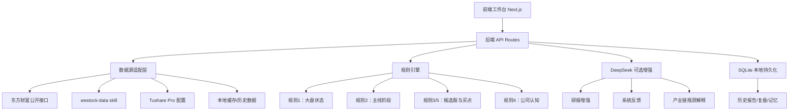
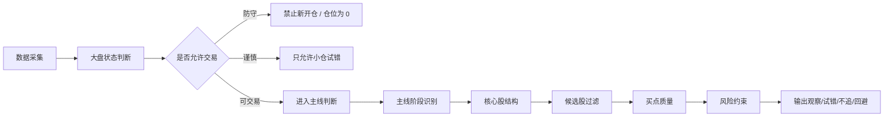
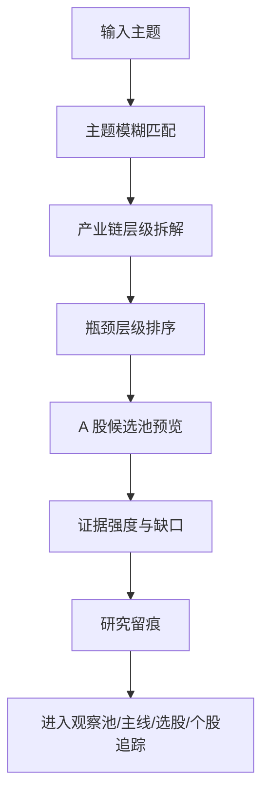

# Chain Alpha Lab｜链枢 Alpha

一个面向 **A 股市场** 的主线趋势、策略选股与产业链瓶颈研究助手。

链枢 Alpha 的目标不是替用户“直接下单”，而是把盘面数据、规则引擎、大模型研判、历史记忆和证据链组织起来，帮助用户更系统地回答几个问题：

- 今天大盘环境适不适合交易？
- 当前市场主线处于启动、确认、加速、分歧还是退潮？
- 哪些候选股真的属于主线，哪些只是蹭概念？
- 强股有没有可执行买点，还是已经涨停/高位不能追？
- 一个产业主题里，真正卡住供给的瓶颈层级在哪里？
- 研究结论是否有公告、财报、主营、资金和盘口证据支撑？

> 重要声明：本项目仅用于投研辅助、规则研究和工程实践，不构成投资建议，不承诺收益，不自动交易，不替代持牌投资顾问服务。

---

## 核心功能

### 1. 大盘状态判断

系统会综合指数趋势、全 A 宽度、涨跌停情绪、主线数量、风险事件和交易时段，判断当前环境：

- 可交易
- 谨慎交易
- 防守观望

并输出对应的仓位约束和风险原因。

### 2. 主线阶段识别

对热门板块和主线方向进行阶段判断：

- 观察
- 启动
- 确认
- 加速
- 分歧
- 退潮

同时跟踪阶段迁移、核心股延续、新核心、退出核心和板块竞争关系。

### 3. 候选强股过滤

候选股会经过多层过滤：

- 趋势结构
- 资金流质量
- 均线乖离
- 主线归属
- 买点质量
- 盘口可交易性
- 公司认知
- 数据完整性

系统会区分“观察、等待回踩、小仓试错、不追、回避、数据不足”等动作。

### 4. 多策略选股

系统已开始支持策略选股工作台，面向不同风格的选股逻辑做规则化筛选和留痕，例如：

- 主力吸筹
- 短期突破
- 价值稳健
- 低风险收益
- 成长潜力
- 板块轮动

后续可继续接入 Agent 复核、策略对比、回测和个股追踪。

### 5. Serenity 供应链瓶颈研究

这是系统的产业链认知模块。

它从一个主题出发，例如：

- AI 半导体
- CPO 光通信
- 先进封装
- 电子特气
- 机器人执行器
- 固态电池

系统会先拆产业链层级，再生成 A 股候选池，并标注：

- 产业链位置
- 瓶颈层级
- 匹配理由
- 证据强度
- 待补证据
- 研究优先级

该模块只输出研究优先级，不直接给买入信号。

### 6. DeepSeek 大模型增强

DeepSeek 用于做规则难以表达的结构化研判，例如：

- 大盘结构解读
- 状态翻转条件
- 主线下一阶段推演
- 核心股结构健康度
- 主线竞争关系
- 盘中盯盘清单
- 系统反馈建议

大模型默认受规则和事实包约束，不能编造行情、财务、公告或资金数据。

### 7. 数据源与留痕

系统强调数据来源留痕和可复盘：

- 东方财富公开行情接口
- westock-data skill 数据能力
- Tushare Pro 配置预留
- 本地 SQLite 数据库
- 报告历史
- 规则诊断
- 模型反馈
- 个股记忆
- 研究 run 留痕

---

## 系统架构图



---

## 主线策略规则链路



---

## Serenity 瓶颈研究流程



---

## 本地启动

### 1. 安装依赖

```bash
npm install
```

### 2. 配置环境变量

复制配置模板：

```bash
cp .env.example .env.local
```

然后在 `.env.local` 中填写自己的配置，例如：

```env
MODEL_API_KEY=
DEEPSEEK_API_KEY=
```

注意：不要提交 `.env.local`。

### 3. 启动开发服务

```bash
npm run dev
```

默认访问：

```text
http://localhost:3000
```

如果使用项目内 Windows 脚本：

```bat
start.bat
```

停止服务：

```bat
stop.bat
```

---

## 常用命令

```bash
npm run dev
npm run typecheck
npm run test
npm run build
npm run analysis:scheduled
npm run analysis:daemon
```

---

## 目录结构

```text
src/
  app/                    Next.js 页面与 API
  components/             前端工作台组件
  lib/
    analysis/             数据采集与分析流程
    strategy/             主线规则与候选股规则
    selection/            策略选股模块
    serenity/             供应链瓶颈研究模块
    llm/                  DeepSeek 调用与校验
    db/                   SQLite 持久化
    eastmoney/            东方财富适配器
    tushare/              Tushare 适配器
scripts/                 定时分析、数据库维护、烟测脚本
docs/                    开源文档、架构图、规则说明
tests/                   测试用例
```

---

## 开源注意事项

请不要提交：

- `.env.local`
- 真实 API Key
- `data/app.db`
- `.next/`
- `node_modules/`
- 运行日志
- 个人过程文档

本仓库只应保存代码、配置模板、正式文档和可公开的测试样例。

---

## 后续规划

- 接入更完整的 Tushare 数据能力
- 完善策略选股 Agent 复核
- 增强个股追踪与持仓复盘
- 增加公告、互动易、财报证据采集
- 做策略回测与效果归因
- 支持 Linux 服务化部署
- 增加消息推送：企业微信、飞书、钉钉等

---

## 免责声明

本项目输出的所有内容仅用于学习、研究和辅助分析。市场有风险，投资需谨慎。任何交易决策都应由使用者独立判断并自行承担后果。
