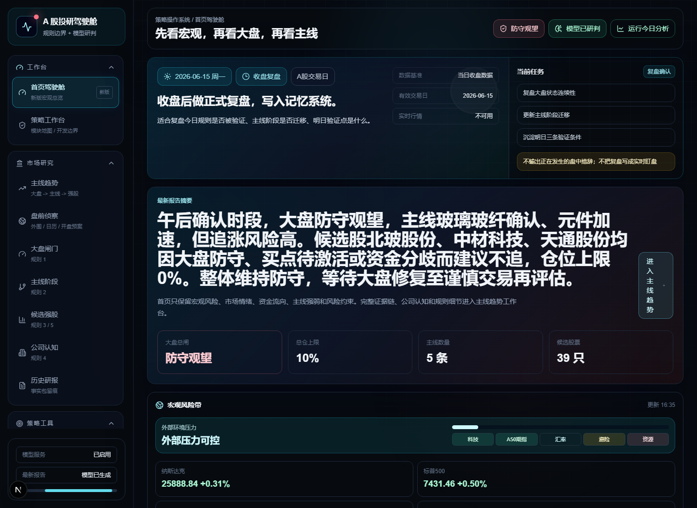

# Chain Alpha Lab｜链枢 Alpha

面向 **A 股市场** 的主线趋势、策略选股与产业链瓶颈研究工作台。

Chain Alpha Lab 不是一个“神奇荐股器”，而是一个把行情数据、规则引擎、DeepSeek 研判、历史记忆、数据源留痕和可视化工作台组织在一起的投研系统。它试图解决一个更实际的问题：在复杂、噪声很高的 A 股环境里，怎样用一套可解释、可复盘、可扩展的系统判断“现在能不能交易、该看哪条主线、哪些股票只是噪声、下一步该验证什么”。

> 免责声明：本项目仅用于量化学习、规则研究和投研辅助，不构成任何投资建议，不承诺收益，不自动交易。市场有风险，投资需谨慎。



## 为什么做这个项目

A 股短线和主线交易里，真正困难的往往不是“看到一个涨停”，而是连续回答这些问题：

- 今天大盘是可交易、谨慎交易，还是应该防守？
- 指数强弱、全 A 宽度、涨跌停情绪和主线强度是否互相印证？
- 当前板块只是日内脉冲，还是已经进入启动、确认、加速阶段？
- 核心股是延续、换龙头，还是退出核心？
- 候选股到底属于主线，还是主营和产业链证据不足？
- 涨停了买不进去时，明天是否存在竞价、回封、分歧修复或等待回踩的方案？
- 大模型输出的判断，是否被真实数据和规则证据约束？

Chain Alpha Lab 的设计目标就是把这些问题拆成规则链路，并留下证据。

## 核心能力

### 1. 首页宏观驾驶舱

首页用于建立当日市场的第一层认知：先看宏观、再看大盘、再看主线。它把市场宽度、涨跌停情绪、资金焦点、规则姿态、交易日状态和最新报告摘要收在一个驾驶舱里，避免一进入系统就被大量表格淹没。


系统也保留了大盘云图这类高信息密度的市场热力视图，用于快速观察全市场行业和个股的红绿分布。它只作为市场体感辅助，不直接参与规则决策。


### 2. 主线趋势驾驶舱

主线追踪是当前系统的核心模块。它从大盘环境开始，逐层推进到主线阶段、核心结构、候选强股和买点质量。


系统目前覆盖：

- 大盘状态：可交易、谨慎交易、防守观望
- 主线阶段：观察、启动、确认、加速、分歧、退潮
- 主线连续性：最近多期报告的改善、恶化和阶段迁移
- 核心结构：延续核心、新核心、退出核心
- 主线竞争：板块之间的资金争夺和同链扩散关系
- 候选强股：主线归属、资金流质量、趋势结构、乖离、买点和风控约束

候选股不会只展示一个股票列表，而是给出定位、跟踪次数、主线归属证据、买点状态、风险提示和可操作性。个股名称支持悬浮查看盘面快照和 K 线结构，方便快速判断“强但能不能买”。


主线归属是系统里非常重要的一环。系统会展示成分股证据、主营/行业匹配、关键词证据和否定/阻断信息，避免把“上涨的股票”粗暴塞进热门主线。


### 3. 盘前侦察与外围风险

盘前模块用于补足“开盘前就应该知道”的信息，包括外围市场、A50、重要事件、新闻情绪和交易时段判断。系统不会在休市日硬凑分析，而是根据交易日、盘前、竞价、午间、尾盘、收盘后等时段采用不同语义。


### 4. 多策略选股工作台

系统已经开始建设策略选股模块，目标是把不同风格的选股逻辑拆成独立策略，并支持后续接入 Agent 复核和回测。


当前规划/实现方向包括：

- 主力吸筹
- 短期突破
- 价值稳健
- 低风险收益
- 成长潜力
- 板块轮动

每个策略都应保留筛选版本、数据来源、命中原因、剔除原因和运行记录，避免只给一个不可解释的股票列表。

### 5. Serenity 产业链瓶颈研究

Serenity 模块用于做产业链和主题研究。它不是直接给买点，而是从一个主题出发，拆解产业链层级，寻找可能的瓶颈环节，并映射到 A 股公司。


适合研究的问题包括：

- AI 半导体中真正稀缺的是设备、材料、设计、封装还是算力基础设施？
- CPO、先进封装、电子特气、机器人执行器、固态电池等主题中，哪个环节更可能形成供需瓶颈？
- 哪些 A 股公司只是概念相关，哪些公司有主营、公告、财务或产业链证据？

### 6. DeepSeek 研判增强

DeepSeek 在系统中不是用来“自由发挥荐股”的，而是做规则难以表达的结构化理解：

- 大盘结构化解读
- 状态翻转条件
- 主线下一阶段推演
- 核心股结构健康度
- 主线竞争关系
- 盘中盯盘清单
- 系统反馈与规则审查建议

模型输出会受到事实包、规则约束和校验层限制，避免凭空编造行情、公告、财务或资金数据。

### 7. Agent 协同复核

系统把大模型能力拆成多个受约束的 Agent 角色，而不是让一个模型直接给最终答案。核心思路是：规则先生成候选池和硬约束，Agent 只在候选池内做审查、解释和分歧标注。

当前设计中的 Agent 体系包括：

- 资金流向分析师：审查主力净流入、资金连续性、资金流入质量和一日游风险。
- 行业板块分析师：审查板块强度、主线归属、板块阶段和同链扩散。
- 财务基本面分析师：审查盈利质量、估值、财务风险和长期逻辑。
- 技术形态分析师：审查趋势结构、均线、突破、回踩、乖离和买点可执行性。
- 量化分析师：审查综合评分、波动、风险收益比和策略适配度。
- 总评审 Agent：综合五位 Agent 的结构化意见，只能在规则候选池内生成最终精选和跟踪计划。

这种设计的目的不是让模型“更敢推荐”，而是让每个结论都能看到是谁支持、谁反对、反对理由是什么，以及哪些数据还不足。

### 8. 模型反馈与系统自审

系统还保留了一个面向开发迭代的模型反馈通道。DeepSeek 可以基于完整报告、规则诊断、数据源状态和历史记忆提出系统性反馈，例如：

- 哪些数据源缺口影响了规则判断。
- 哪些规则阈值可能过严或过松。
- 哪些个股主线归属证据不足。
- 哪些买点被大盘风控压制，但应标记为“待激活”。
- 哪些报告模块需要增加可解释字段。

这些反馈会进入历史列表，等待人工评估后再决定是否更新到系统，不会自动改规则。

## 规则与架构

系统采用“规则先行，大模型增强”的架构：硬规则负责风控边界、阶段判定和证据链；大模型负责解释、推演、复盘和提出可审查的改进建议。


核心链路：

1. 数据采集与归一化
2. 数据质量检查与来源留痕
3. 大盘状态判断
4. 主线阶段识别
5. 核心股结构追踪
6. 候选股过滤与主线归属证据链
7. 买点质量与风险约束
8. DeepSeek 研判增强
9. 多 Agent 分工复核
10. 报告、记忆、反馈和复盘留痕

## 数据与存储

项目采用多数据源适配思路，尽量降低对单一来源的绑定：

- 东方财富公开行情接口
- westock-data skill 能力
- Tushare Pro 配置预留与接入
- 本地 SQLite 数据库
- 数据源健康检查
- 报告历史、策略运行、模型反馈、个股记忆与研究 run 留痕

后续如果迁移到 PostgreSQL 或接入更高权限的 Tushare，业务层应尽量保持稳定，只替换数据适配层和仓储层。

## 快速启动

### 安装依赖

```bash
npm install
```

### 配置环境变量

复制配置模板：

```bash
cp .env.example .env.local
```

然后在 `.env.local` 中填写自己的配置，例如：

```env
DEEPSEEK_API_KEY=
TUSHARE_TOKEN=
```

不要提交 `.env.local`、真实 API Key、本地数据库或运行日志。

### 启动开发服务

```bash
npm run dev
```

默认访问：

```text
http://localhost:3000
```

Windows 也可以使用：

```bat
start.bat
```

停止服务：

```bat
stop.bat
```

## 常用命令

```bash
npm run typecheck
npm run test
npm run build
npm run analysis:scheduled
npm run analysis:daemon
npm run db:stats
```

## 项目结构

```text
src/
  app/                    Next.js 页面与 API
  components/             前端工作台组件
  lib/
    analysis/             数据采集与分析流程
    strategy/             主线规则与候选股规则
    selection/            策略选股模块
    serenity/             供应链瓶颈研究模块
    llm/                  DeepSeek 调用、Agent Prompt 与输出校验
    db/                   SQLite 持久化
    eastmoney/            东方财富适配器
    tushare/              Tushare 适配器
docs/                     架构、规则、数据源与展示资产
scripts/                  定时分析、数据库维护、烟测脚本
tests/                    测试用例
```

## 文档

- [项目介绍](./项目介绍.md)
- [部署启动说明](./部署启动说明.md)
- [架构说明](./docs/architecture.md)
- [规则说明](./docs/rules.md)
- [数据源说明](./docs/data-sources.md)
- [Serenity 瓶颈研究](./docs/serenity.md)

## 当前状态与后续计划

当前项目仍处于快速迭代阶段，重点是把主线策略、选股策略、产业链研究和数据源解耦逐步打磨成可长期维护的系统。

后续重点：

- 完善 Tushare 数据接入和数据源优先级配置
- 强化五位 Agent 复核、总评审 Agent 和运行留痕
- 增加个股追踪、持仓复盘和交易计划管理
- 接入公告、财报、互动易、新闻事件等证据源
- 增加策略回测、命中统计和失败归因
- 支持 Linux 服务化部署、定时任务和消息推送

## 开源边界

本仓库适合保存代码、配置模板、正式文档和可公开截图。不应提交：

- `.env.local`
- 真实 API Key
- `data/app.db`
- `.next/`
- `node_modules/`
- 运行日志
- 个人过程文件

## License

当前项目为个人研究型开源项目。使用前请自行评估数据源合规性、交易风险和部署安全。
