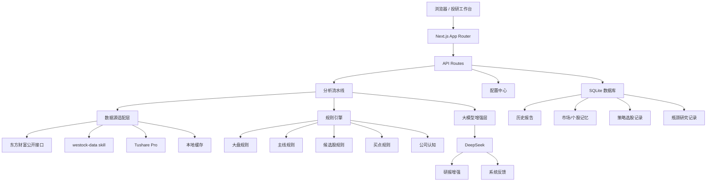
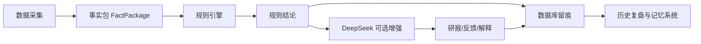

# 系统架构

链枢 Alpha 使用 Next.js + TypeScript + SQLite 构建，核心思想是将数据源、规则引擎、大模型、历史记忆和前端工作台分层解耦。

---

## 架构总览

---

## 分层说明

### 前端层

位于 `src/components` 和 `src/app`。

主要模块：

- 投研驾驶舱；
- 主线追踪；
- 盘前侦察；
- 策略选股；
- 个股追踪；
- Serenity 瓶颈研究；
- 配置中心。

### API 层

位于 `src/app/api`。

负责：

- 启动分析；
- 查询历史报告；
- 保存设置；
- 测试数据源；
- 执行策略选股；
- 生成瓶颈研究；
- 查询模型反馈。

### 数据层

位于：

- `src/lib/eastmoney`
- `src/lib/westock`
- `src/lib/tushare`
- `src/lib/data`

原则：

- 数据来源必须留痕；
- 不同数据源字段需要归一化；
- 数据缺失要明确标注，不使用模型猜测。

### 规则层

位于 `src/lib/strategy`。

规则层负责生成硬约束，例如：

- 大盘是否可交易；
- 主线处于什么阶段；
- 个股是否属于主线；
- 是否有买点；
- 是否禁止追高；
- 是否仓位为 0。

### 大模型层

位于 `src/lib/llm`。

大模型只负责：

- 解释规则结果；
- 总结市场结构；
- 输出状态翻转条件；
- 提供系统反馈；
- 生成研究语言。

大模型不应该：

- 编造行情；
- 编造公告；
- 编造财务；
- 越过风控直接给买入建议。

---

## 数据流

---

## 扩展方向

未来可以继续拆分：

- 数据源 Provider 接口；
- PostgreSQL/MySQL 持久化；
- 队列任务；
- 多用户权限；
- WebSocket 实时推送；
- Docker 部署；
- 回测服务。
