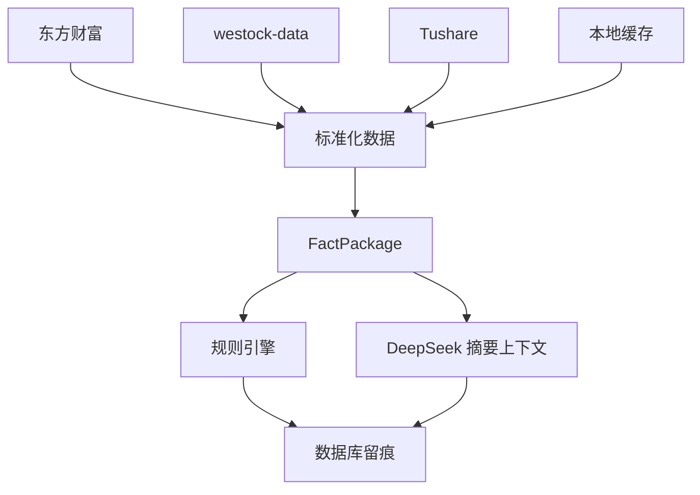

# 数据源说明

链枢 Alpha 使用多数据源融合方式，目标是尽量提高 A 股数据覆盖率，并保留来源留痕。

---

## 数据源列表

### 东方财富公开接口

用途：

- 全 A 行情；
- 市场宽度；
- 板块成分；
- 涨停池；
- 跌停池；
- 炸板池；
- 个股报价；
- 个股 K 线；
- 个股资金流；
- 公司 F10 基础资料。

特点：

- 覆盖广；
- 适合行情和板块结构；
- 公开接口可能变化，需要做好失败降级。

### westock-data skill

用途：

- 个股 K 线；
- 技术指标；
- 资金流；
- 财务数据；
- 股东结构；
- 公司资料；
- 指数和板块数据。

特点：

- 能力覆盖多；
- 适合做系统快速补数；
- 需要保留真实来源说明。

### Tushare Pro

用途规划：

- 交易日历；
- 日线和复权行情；
- daily_basic；
- moneyflow；
- 财务指标；
- 股东户数；
- 公告；
- 指数成分；
- 长周期历史校验。

特点：

- 结构化程度高；
- 适合长期数据和回测；
- 需要用户自行配置 token 和权限。

### 本地 SQLite

用途：

- 保存分析报告；
- 保存策略运行记录；
- 保存模型反馈；
- 保存个股记忆；
- 保存瓶颈研究 run；
- 保存配置和数据源状态。

---

## 数据原则

1. **不编造数据**  
   数据取不到时，标记缺失，不让模型猜。

2. **保留来源**  
   重要数据要记录 provider、字段、时间、质量和警告。

3. **分级使用**  
   实时盘口、日线、财务、公告、模型结论属于不同可信层级。

4. **失败降级**  
   单一数据源失败时，可使用备用来源；都失败时阻断或降级。

---

## 数据流

---

## 开源安全

不要提交：

- Tushare token；
- DeepSeek key；
- webhook；
- 本地数据库；
- 个人日志；
- 历史私有报告。

只提交：

- 适配器代码；
- 配置模板；
- 数据字段说明；
- 可公开测试样例。
