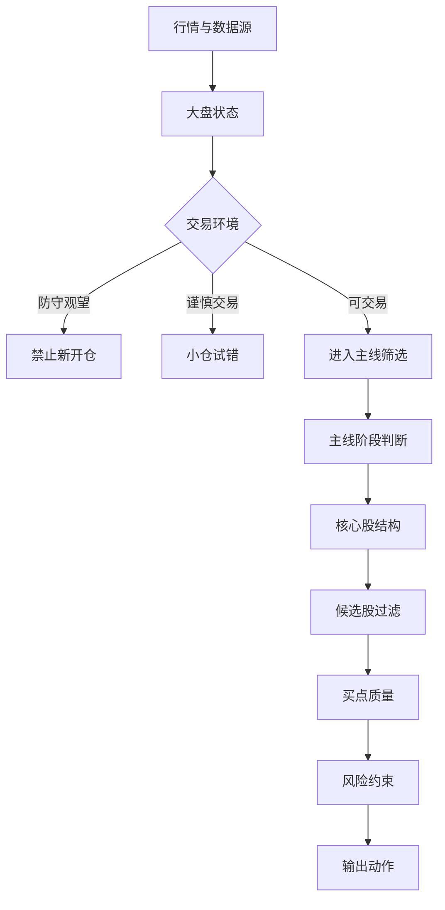

# 规则引擎说明

链枢 Alpha 的规则引擎遵循“先市场，后主线，再个股，最后买点”的顺序。

---

## 总体流程

---

## 规则 1：大盘状态

目标：判断市场是否适合交易。

主要考虑：

- 核心指数趋势；
- 全 A 上涨占比；
- 中位涨跌幅；
- 涨停、跌停、炸板；
- 主线数量和质量；
- 风险事件；
- 最近几天连续性；
- 当前交易时段。

输出：

- 可交易；
- 谨慎交易；
- 防守观望。

---

## 规则 2：主线阶段

目标：判断板块处于哪个生命周期阶段。

阶段：

- 观察；
- 启动；
- 确认；
- 加速；
- 分歧；
- 退潮。

主要考虑：

- 板块涨幅；
- 板块资金；
- 成分股扩散；
- 核心股强度；
- 涨停结构；
- 阶段迁移；
- 历史连续性；
- 核心股是否换龙头。

---

## 规则 3：候选强股过滤

目标：判断股票是否值得进入观察或试错。

主要考虑：

- 是否属于当前主线；
- 是否为核心股/中军/补涨；
- 趋势结构；
- 资金流质量；
- 活跃度；
- 数据完整性；
- 高位追涨风险；
- 是否涨停买不进去。

---

## 规则 4：公司认知

目标：判断公司是否真的匹配主线。

证据来源：

- 主营业务；
- 行业分类；
- 板块成分；
- 产业链位置；
- 财务摘要；
- 股东结构；
- 公告和公开资料。

输出：

- 强匹配；
- 中等匹配；
- 弱相关；
- 主题偏离；
- 数据不足。

---

## 规则 5：买点质量

目标：判断是否存在可执行买点。

买点类型：

- 回踩均线；
- 突破回踩；
- 分歧修复；
- 次日竞价观察；
- 尾盘确认；
- 无买点。

买点不会单独决定买入，还必须受大盘状态、主线阶段和风险约束限制。

---

## 风控约束

系统会明确区分：

- 观察；
- 小仓试错；
- 等待回踩；
- 不追；
- 回避；
- 数据不足。

当大盘防守时，系统默认不允许新开仓。

---

## 大模型边界

DeepSeek 可以解释规则，但不能替代规则。

允许：

- 解释为什么防守；
- 提供翻转条件；
- 推演主线下一阶段；
- 总结风险；
- 提醒缺失证据。

不允许：

- 编造数据；
- 无视规则给买入；
- 无视风控提高仓位。
