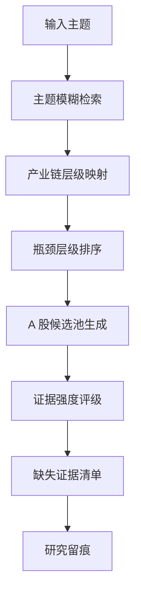

# Serenity 供应链瓶颈研究

Serenity 模块用于从产业主题出发，寻找 A 股中更接近真实供给瓶颈的层级和公司。

它不是交易模块，不直接输出买入信号。

---

## 研究逻辑

```text
主题 -> 产业链层级 -> 稀缺瓶颈 -> A 股候选 -> 证据强度 -> 研究优先级
```

示例：

```text
AI 半导体
  -> 关键设备/工艺平台
  -> 材料与耗材
  -> 先进封装与测试
  -> 算力芯片/设计
  -> A 股候选公司
  -> 证据链验证
```

---

## 流程图



---

## 当前支持主题

内置主题包括：

- AI 半导体；
- CPO 光通信；
- 先进封装；
- 电子特气；
- 机器人执行器；
- 固态电池；
- 液冷服务器；
- 高速 PCB 与材料。

---

## 候选来源

当前候选池来源：

1. 最新系统报告中的主线、核心股和候选股；
2. 东方财富相关板块成分股；
3. 后续计划接入 Tushare、公告、财报和互动易。

---

## 证据强度

证据分为：

- strong：强证据，例如公告、财报、订单、客户认证；
- medium：中等证据，例如成分股、主营匹配、历史报告核心股；
- weak：弱证据，例如概念板块相关；
- needs_checking：待核验线索。

---

## 评分维度

正向因子：

- 需求拐点；
- 架构耦合；
- 瓶颈强度；
- 供应商集中；
- 扩产难度；
- 证据质量；
- 认知差；
- 催化时点。

风险扣分：

- 融资稀释；
- 治理风险；
- 地缘风险；
- 流动性风险；
- 概念炒作；
- 会计质量；
- 周期性；
- 替代路径风险。

---

## 与主系统关系

Serenity 输出的是研究优先级，可用于：

- 辅助主线归属判断；
- 发现产业链真正核心；
- 剔除蹭概念公司；
- 为个股追踪提供长期逻辑；
- 为策略选股提供产业链标签。

但最终交易动作仍由：

```text
大盘状态 -> 主线阶段 -> 候选过滤 -> 买点质量 -> 风控仓位
```

决定。
