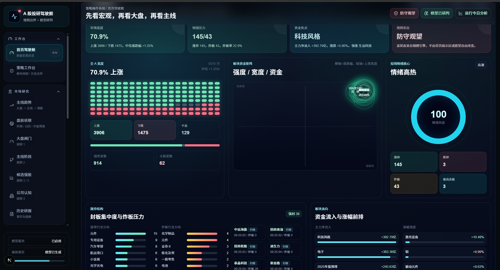
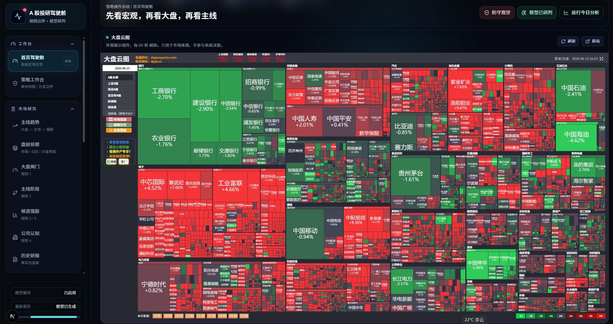
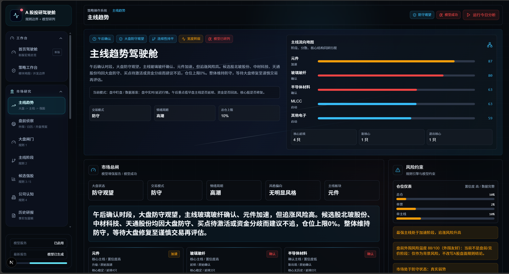
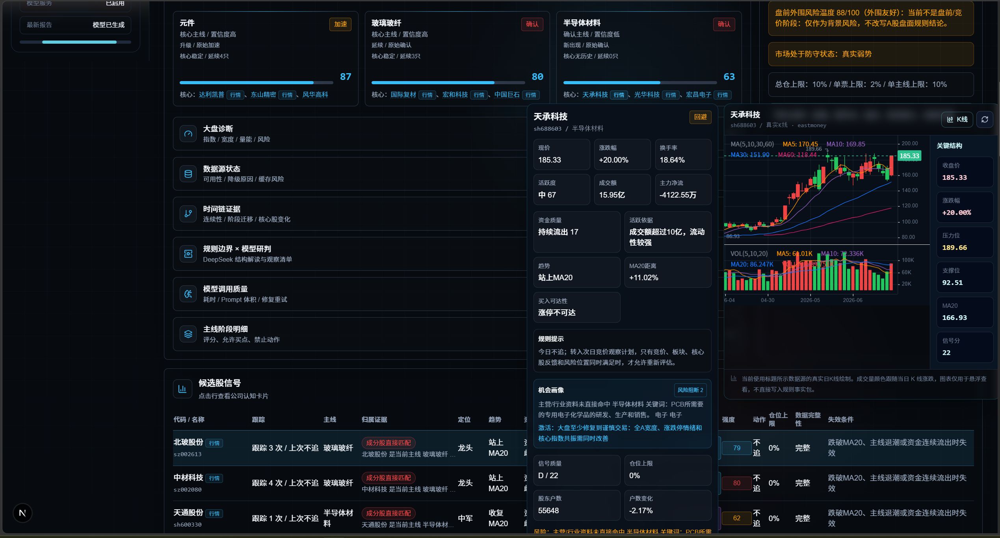
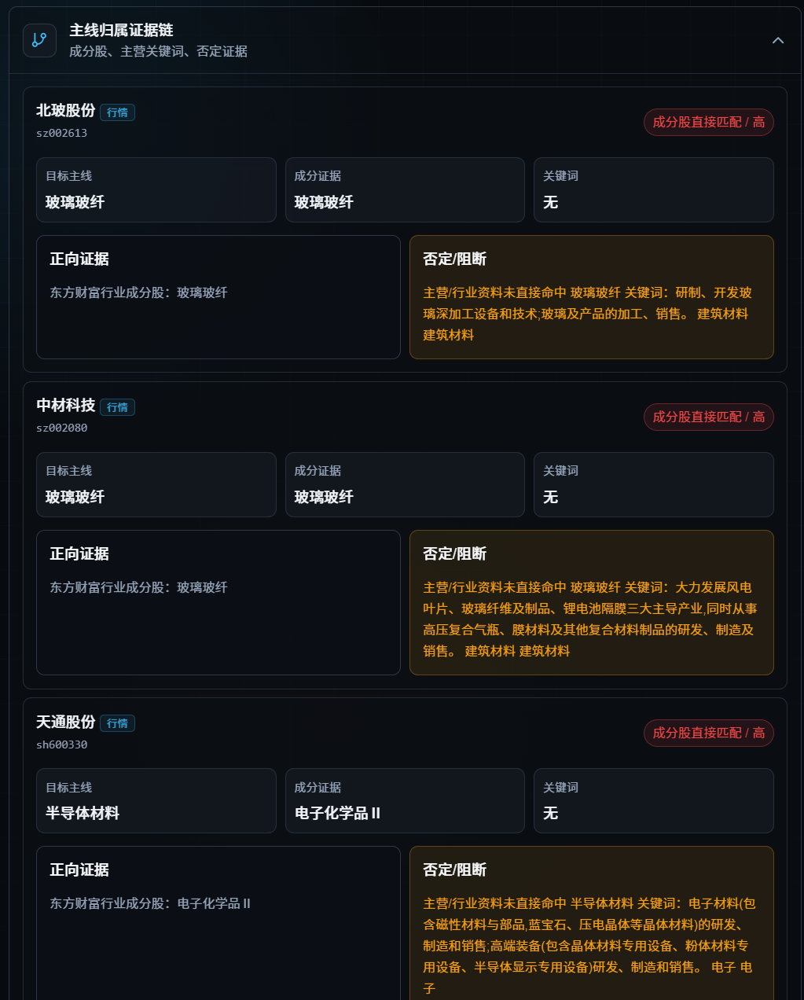
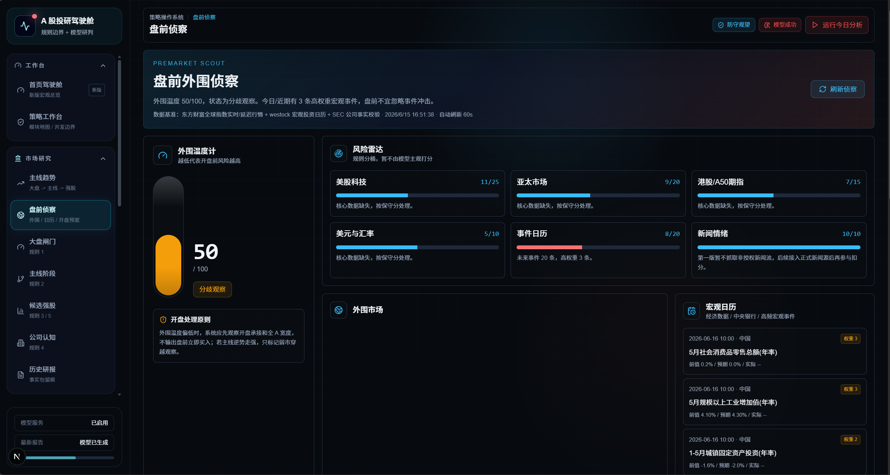
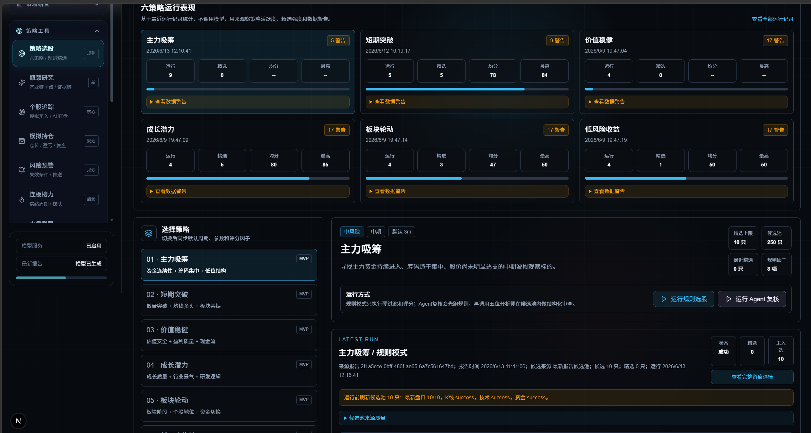
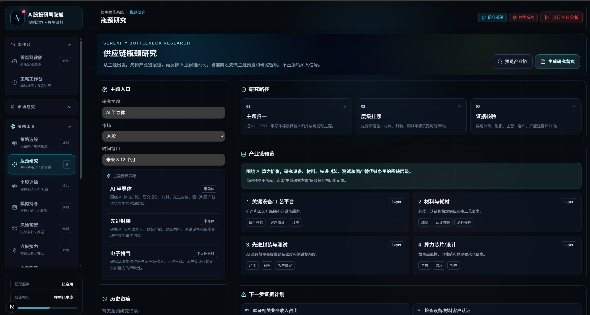
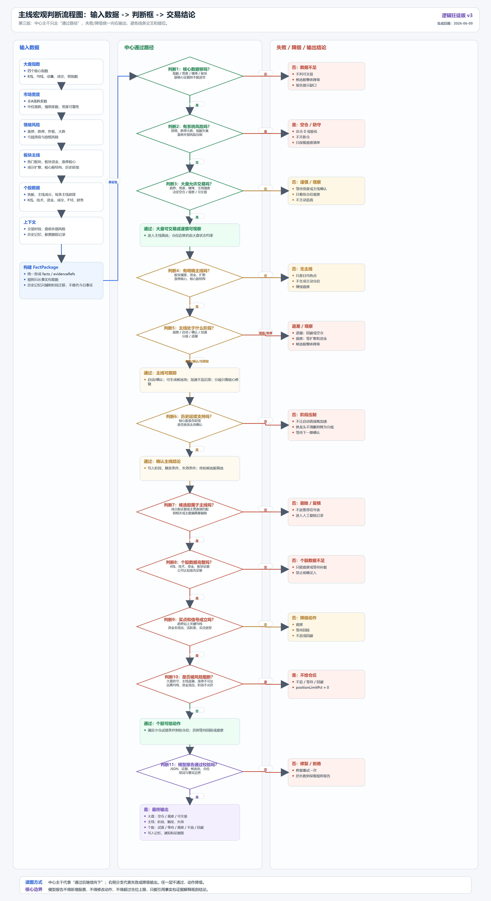
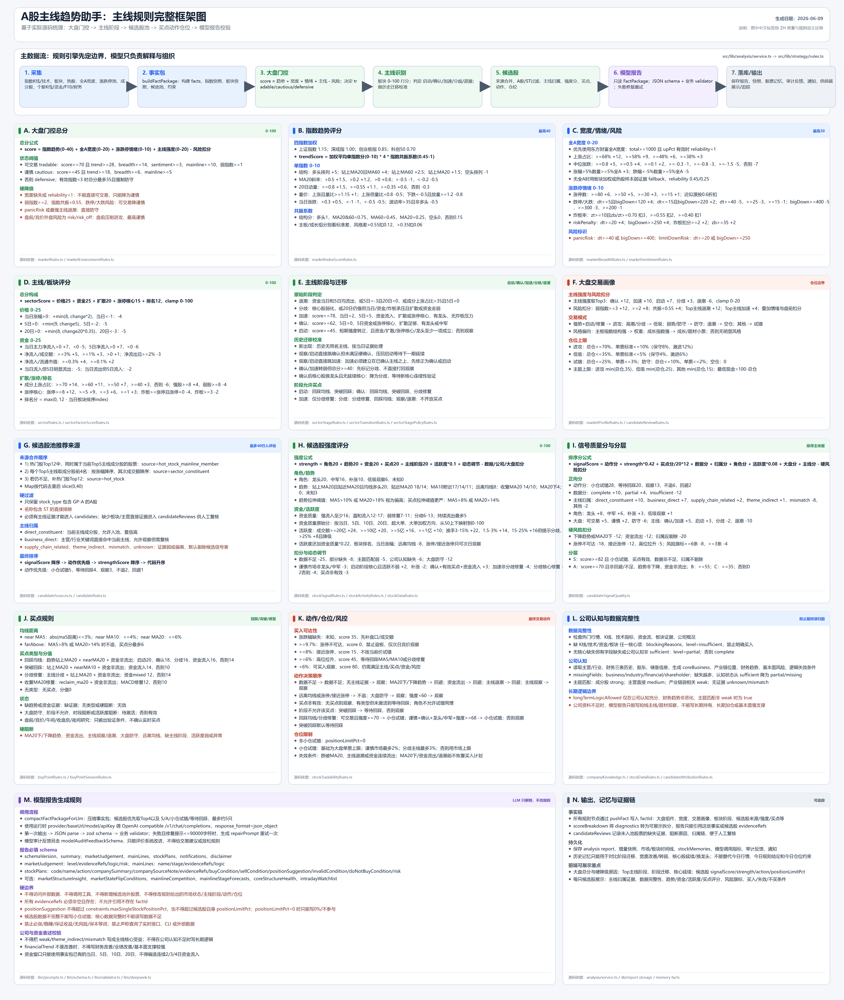

# Chain Alpha Lab｜链枢 Alpha 项目介绍

Chain Alpha Lab 是一个面向 A 股市场的投研辅助系统，核心方向是 **主线趋势判断、多策略选股、产业链瓶颈研究和可复盘的规则引擎**。

它不是单纯的信息看板，也不是让大模型直接推荐股票。系统的设计原则是：先用真实数据和硬规则建立边界，再让大模型在事实包和证据链内做结构化解释、阶段推演和反馈建议。

## 一句话理解

链枢 Alpha 想做的是一个 A 股投研驾驶舱：

- 大盘不好时，先保护本金，不硬找机会。
- 主线没有确认时，只观察和验证，不把脉冲当趋势。
- 个股没有主线归属证据时，不因为上涨就强行纳入。
- 买点不可执行时，明确“不追、等回踩、等分歧修复或等竞价确认”。
- 大模型只负责帮助理解市场结构，不越过数据和规则直接给结论。

## 系统正在解决的问题

A 股交易中有大量“看起来很热闹但难以执行”的信息：

- 热门板块很多，但不知道哪条是真主线。
- 个股涨停很多，但买不进去，也不知道次日是否还能看。
- 新闻和题材很多，但产业链位置、公司主营和真实受益程度不清楚。
- 大模型分析很会写，但如果没有事实约束，容易变成漂亮废话。
- 每天的判断如果不留痕，复盘时无法知道自己是规则错、数据错还是执行错。

Chain Alpha Lab 的核心价值，就是把这些判断拆成可以检查、可以解释、可以复盘的系统流程。

## 产品模块

### 1. 首页投研驾驶舱

首页承担“开盘前和盘中快速建立全局感”的作用，包括市场状态、关键风险、资金情绪、重要事件、主线概览和系统入口。

它不追求把所有表格堆在一页，而是希望用户第一眼就能知道：

- 今天是交易日还是休市日？
- 当前更应该进攻、谨慎还是防守？
- 哪些风险正在影响仓位？
- 哪些模块值得继续深入查看？

首页还可以放置高信息密度的市场热力视图。大盘云图主要用于观察全市场红绿分布、行业拥挤度和局部抱团方向，它是“市场体感层”，不直接替代系统规则。

### 2. 主线追踪

主线追踪是系统当前最核心的策略模块。

它按层级判断：

1. 大盘状态是否允许交易。
2. 哪些板块有主线潜质。
3. 主线处于观察、启动、确认、加速、分歧还是退潮。
4. 核心股是否延续，是否出现新核心，是否有核心退出。
5. 候选股是否真的属于主线。
6. 当前是否存在可执行买点。
7. 风险约束是否允许开仓、试错或继续观察。

这个模块的重点不是给出一个“买”字，而是解释为什么能买、为什么不能买、还差什么条件。

候选股池是主线追踪向个股层下钻的入口。它展示候选股定位、所属主线、主线归属证据、趋势状态、买点状态、仓位上限、失效条件和风险提示。对于涨停不可买、乖离过高、资金质量不足、主线证据弱的股票，系统会明确标记“不追、等待回踩、观察或回避”。

为了避免“题材乱贴标签”，系统专门做了主线归属证据链。它会把成分股证据、主营/行业证据、关键词证据和否定/阻断证据放在一起，让用户看清楚：这只股票为什么属于这条主线，或者为什么只是弱相关。

### 3. 盘前侦察

盘前模块用于处理外围市场、A50、重大事件、新闻情绪和交易时段差异。

它解决的是用户在开盘前已经能主观感受到的风险，比如外围科技股大跌、日韩市场异动、A50 偏离、重大宏观事件等。系统会把这些信息转化为盘前风险温度、开盘观察点和需要验证的条件。

### 4. 多策略选股

多策略选股模块的目标是为不同市场风格建立可解释的筛选器。

当前策略方向包括：

- 主力吸筹：寻找资金持续流入、量价结构改善但尚未过热的标的。
- 短期突破：寻找趋势突破、回踩确认或强势延续机会。
- 价值稳健：关注财务质量、估值安全边际和低波动收益。
- 低风险收益：偏向防守型、回撤可控的候选。
- 成长潜力：关注收入利润成长、产业趋势和景气度。
- 板块轮动：捕捉资金在行业和概念之间的迁移。

选股模块后续会继续接入 Agent 复核、回测、策略对比和个股追踪。

### 5. Serenity 产业链瓶颈研究

Serenity 是一个研究模块，适合从主题出发寻找产业链瓶颈。

例如输入“AI 半导体”“CPO”“先进封装”“电子特气”“机器人执行器”等主题后，系统会尝试拆解：

- 产业链有哪些层级？
- 哪个环节更可能成为供需瓶颈？
- A 股公司处于什么产业链位置？
- 匹配证据来自主营、公告、财务、板块成分还是关键词？
- 哪些公司需要进一步补证，哪些只是弱相关？

Serenity 模块只给研究优先级和证据强度，不直接给交易买点。

## 规则框架

系统采用层层递进的规则链路。前面的层级没有通过，后面的信号会降级或进入观察。

当前核心规则可以理解为：

1. 大盘环境是总闸门。
2. 主线阶段决定能不能看机会。
3. 主线归属决定股票是否有资格进入候选。
4. 公司认知决定是否存在认知偏差和主题偏离。
5. 买点质量决定是否可执行。
6. 风险约束决定仓位和动作上限。

这种设计的好处是：系统不会因为单只股票强就忽略市场环境，也不会因为大盘稍微转暖就随便放宽主线和个股证据。

## DeepSeek 如何参与

DeepSeek 的角色不是替代规则，而是担任“结构化投研助手”：

- 解释为什么当前是防守、谨慎或可交易。
- 输出大盘状态翻转条件。
- 推演主线下一阶段。
- 判断核心股结构是否健康。
- 梳理主线之间的竞争关系。
- 生成盘中盯盘清单。
- 给系统规则提出反馈建议。

系统会尽量把模型输入压缩成事实包，而不是把所有历史原文塞给模型，减少 token 消耗，同时避免历史越来越长后上下文失效。

## Agent 体系如何参与

项目中设计的大模型能力不是单点调用，而是分成多个专业 Agent。这样做的原因很简单：A 股判断不是单维度问题，资金、板块、基本面、技术形态和量化风险经常互相冲突。如果只让一个模型写一段总结，很容易把矛盾抹平；拆成多个 Agent 后，系统可以把分歧显式暴露出来。

当前选股模块规划并部分接入的 Agent 团队包括：

- **资金流向分析师**：关注主力净流入、5 日/20 日资金趋势、资金流入质量、资金是否只是一日脉冲。
- **行业板块分析师**：关注个股是否属于当前主线，板块处于哪个阶段，是否有同链扩散和资金切换。
- **财务基本面分析师**：关注盈利质量、估值安全边际、现金流、ROE、负债和长期风险。
- **技术形态分析师**：关注均线结构、突破回踩、分歧修复、乖离、涨停后的次日可执行方案。
- **量化分析师**：关注综合评分、波动水平、风险收益比、策略适配度和排序稳定性。
- **总评审 Agent**：只综合前面五位 Agent 和规则评分，不新增候选池外股票，不突破仓位和风控边界。

Agent 的运行边界是明确的：

1. 规则引擎先生成候选池、硬过滤、评分和风险约束。
2. Agent 只能基于输入事实包、候选池和规则结果分析。
3. Agent 不能自行抓数据，不能编造行情，不能新增股票。
4. Agent 的输出必须是结构化 JSON，便于校验、存储和前端展示。
5. 如果 Agent 输出越权、引用不存在事实或突破风控，系统应拒绝或降级为规则结果。

这套设计让大模型更像一个“投研委员会”：每位成员从自己的维度提出意见，总评审做综合，但最终仍受规则边界约束。

## 模型反馈与系统自审

系统还设计了一个专门的“模型反馈”模块，让 DeepSeek 反过来审查系统自身。它可以基于一次完整报告指出：

- 数据源是否缺了关键字段。
- 主线阶段判断是否存在规则盲区。
- 候选股主线归属是否证据不足。
- 买点质量是否过度依赖某个指标。
- 大盘风控是否过严导致所有机会被压制。
- UI 是否缺少必要解释，导致用户无法理解结论。

这些反馈不会自动进入规则，而是作为“待评估建议”留痕。用户可以把反馈交给开发者或主 Agent 再判断是否采纳。这样系统可以持续进化，同时避免模型直接改规则带来的风险。

## 数据源和留痕

系统强调“数据从哪里来、什么时候取到、是否可靠”。

当前设计包含：

- 东方财富公开行情数据
- westock-data skill 数据能力
- Tushare Pro 配置和测试连接
- 本地 SQLite 存储
- 数据源健康状态
- 报告历史
- 模型反馈历史
- 策略运行历史
- Agent 输出历史
- 个股记忆和研究 run 留痕

未来如果某个数据源失效，目标不是重写业务规则，而是替换或增强数据适配层。

## 工程特点

- Next.js 前后端一体开发
- TypeScript 类型约束
- 规则引擎模块化
- 数据源适配层逐步解耦
- SQLite 本地持久化，预留未来换库空间
- 支持定时分析和手动分析
- 支持 Windows 启停脚本，后续可扩展 Linux 部署
- 文档、架构图、规则说明和截图随项目一起维护
- 模型调用、token、耗时、失败原因和重试次数可逐步纳入质量监控

## 已有文档

- [README](./README.md)
- [部署启动说明](./部署启动说明.md)
- [架构说明](./docs/architecture.md)
- [规则说明](./docs/rules.md)
- [数据源说明](./docs/data-sources.md)
- [Serenity 瓶颈研究](./docs/serenity.md)

## 后续方向

接下来系统仍会沿着三个方向迭代：

1. **可靠性**：补齐数据源、数据质量校验、异常降级和规则回放。
2. **策略能力**：完善主线策略、多策略选股、个股追踪、回测和复盘。
3. **产品体验**：降低页面信息密度，用卡片、折叠、悬浮详情和证据链视图让关键信息更容易看懂。

最终目标不是做一个“看起来很炫”的页面，而是做一个能长期帮助复盘、减少冲动交易、提升主线判断质量的 A 股投研系统。
